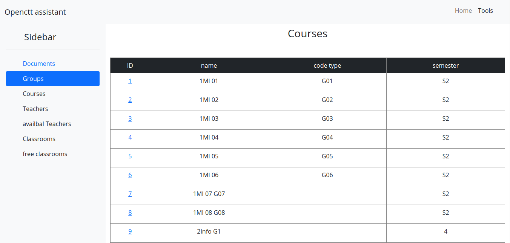
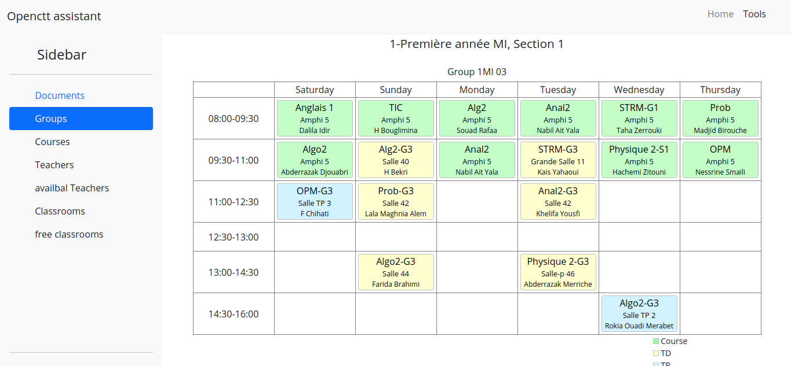
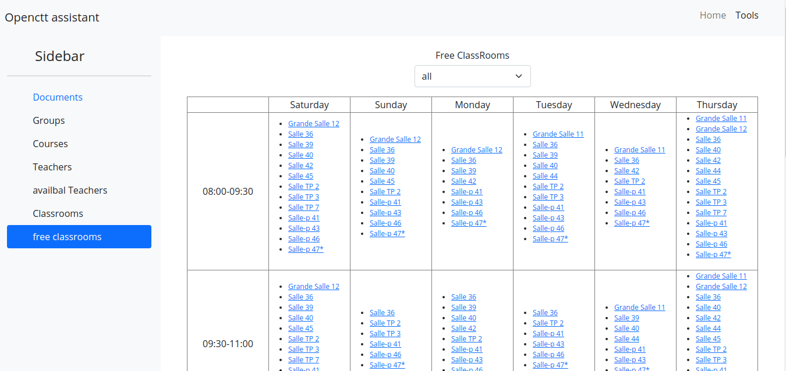

## openctt-assistant
is an open source assistant for open course timetable programe ([openctt](https://sourceforge.net/projects/openctt/))

### Setup
```
python3 -m venv my-env
```

```shell
source my-env/bin/activate
```
```shell
pip install -r requirements.txt
```
```shell
uvicorn api:app --reload
```

finally open `index.html` in browser

### screenshots





